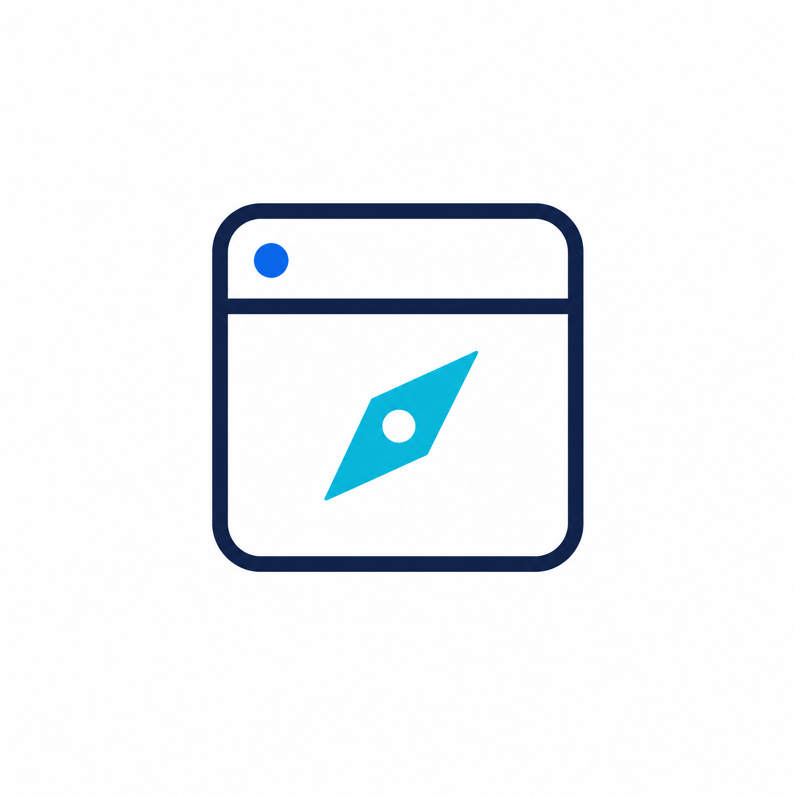

# 浮悬浏览器



> **白底极简的原生 Kotlin Android 浏览器。** 以网页内容为中心，使用底部低干扰控制区、多标签浏览和独立本地搜索首页；不使用 Expo、React Native 或 Jetpack Compose。（此项目为Vibe Coding）

[](https://developer.android.com/)
[](https://kotlinlang.org/)
[](LICENSE)

## 设计原则

浮悬浏览器将网页置于视觉中心。导航、标签和工具不隐藏，但以轻量的底部控件长期保留。极简模式使用透出网页内容的磨砂椭圆 Tab；完整模式使用包住双行控件的磨砂圆角长方形。系统状态栏和导航栏始终可用。

| 维度 | 设计选择 |
|---|---|
| 产品定位 | 轻量、多标签、原生 Android WebView 浏览器 |
| 搜索体验 | 新标签显示可编辑的本地搜索首页；提交关键词后才按当前搜索引擎跳转结果页。 |
| 控制布局 | 底部等边距 Tab 容器、地址栏、椭圆形后退/前进/刷新组、标签页入口与工具栏；网页从容器下方透出。极简主栏不再显示独立加号。 |
| Tab 模式 | 设置中固定选择“始终极简”或“始终完整”；完整模式为包住双行控件的圆角长方形。 |
| 完整 Tab 圆角 | 在完整模式下可用 0–100% 滑杆调整四个角的圆润程度；默认 28%。 |
| 工具栏 | 从 Tab 区上方弹出的独立双列菜单，支持空白处与返回键关闭 |
| 磨砂表现 | Android 12+ 以网页局部快照实现模糊，旧系统使用透明降级层。 |

## 功能

| 模块 | 当前能力 |
|---|---|
| 多标签 | 创建、切换、关闭 WebView 标签；极简模式点击计数入口会以触发点为原点打开无全屏遮罩的独立磨砂小浮窗。标签以两列横向网格展示、右侧提供关闭按钮；标签增加时窗口从底部向上扩展，达到限高后在内部滚动，底部保留“新建标签页”入口；完整模式显示可切换的标签条。标签文字垂直居中对齐。 |
| 地址与搜索 | 支持 HTTP(S) 地址、常见域名与可选搜索引擎。搜索设置仅显示“搜索引擎”；向右滑动可进入自定义名称与搜索地址输入。切换立即更新首页而不重建设置页；地址栏在搜索结果页显示本次关键词，在其他网页显示网页标题。 |
| 首页 UI | 设置中的独立“首页 UI”页面顶部提供实时预览；以“内容 / 文字 / 搜索框”分类展示对应设置。可选择搜索引擎名或自定义标题，配置标题字号、加粗、斜体与调色盘颜色，并以精致 0–100% 滑杆调整搜索框圆角、不透明度和模糊强度。相关输入与调色盘使用统一的圆角磨砂弹窗。 |
| Tab 工具 | 添加/移除书签、下载管理、分享、复制网址、清缓存、回首页、关闭标签、刷新和设置。 |
| 系统栏 | 状态栏与导航栏保持系统可用；网页内容自然延伸到其下方，并通过轻量渐变遮罩柔化图标与网页内容的交界。 |
| 主题 | 支持浅色、深色与跟随系统；所有模式统一使用现有磨砂视觉。 |
| 返回手势 | 可选“无 / AOSP / Miuix / 缩放 / 经典”。点击选项会立即切换并刷新当前选中状态；设置、工具栏、下载确认、下载管理、应用信息、网页历史和多标签关闭均走统一返回分发；AOSP 在根页面交还系统返回桌面动画。[3] [4] |
| 网页下载 | 内置下载器将网页任务登记到 Android `DownloadManager`。下载管理页支持自动刷新、任务打开、底部多选与批量删除；批量删除会确认是否同时删除已完成文件，默认仅移除下载任务并保留文件。 |
| 下载长按操作 | 已完成任务长按可打开、分享和重命名；进行中任务可取消并删除。Android 10+ 会尝试通过内容 URI 更新实际显示名称，无法修改时保留应用内列表名称并明确提示。 |
| 下载实时通知 | 内置下载开始后，按需启动 `dataSync` 前台服务；即使返回桌面，也会以真实文件名、下载字节、百分比和每秒字节差分速度持续更新。 |
| WebView 安全 | 禁止混合内容、文件访问和内容访问；非 HTTP(S) 协议交由系统处理。 |

> Android 16+ 是否将进度通知提升为系统实时动态通知，取决于系统策略、用户设置与设备实现。无论是否被提升，普通系统通知栏中可见、持续更新的下载进度通知才是基本验收条件。[1] [2]

## 应用标识与环境

| 项目 | 当前值 |
|---|---|
| 应用 ID / namespace | `com.mmckb.browser` |
| 显示名称 | 浮悬浏览器 |
| 最低 Android 版本 | Android 7.0（API 24） |
| compileSdk / targetSdk | 36 |
| Java / Kotlin JVM 目标 | 17 |
| Gradle / Android Gradle Plugin | 8.11.1 / 8.9.1 |
| Kotlin | 2.0.21 |

## 本地构建

准备 Android SDK 与 JDK 17 后，在仓库根目录运行：

```bash
./gradlew :app:assembleDebug
```

资源受限环境可使用单工作线程进行完整验证：

```bash
ANDROID_HOME=/path/to/android-sdk \
ANDROID_SDK_ROOT=/path/to/android-sdk \
JAVA_HOME=/path/to/jdk-17 \
./gradlew clean :app:assembleDebug :app:assembleRelease :app:lintDebug --no-daemon --max-workers=1
```

调试 APK 默认输出至：

```text
app/build/outputs/apk/debug/app-debug.apk
```

调试与发布构建均使用同一份 **MMCKB** 证书。仓库不包含私钥：本地使用被忽略的 `signing.properties`，GitHub Actions 使用 `KEYSTORE_BASE64`、`KEYSTORE_PASSWORD`、`KEY_ALIAS` 与 `KEY_PASSWORD` 机密。请勿提交密钥库、属性文件或口令。

## 下载与通知验收

1. 在网页触发下载，并在下载确认页选择 **应用内下载**。
2. 打开 `⋮ → 下载`，确认进行中任务在首个采样周期后显示 `B/s`、`KB/s`、`MB/s` 或 `GB/s`；顶部不再显示实时通知诊断文字，右上角只保留关闭按钮。
3. 使用左下角 **多选**，勾选多个任务后点 **删除**。在确认弹窗中，勾选“同时删除已完成的文件”会尝试删除文件；不勾选则只从浏览器列表移除下载任务并保留文件。再点 **取消多选** 退出选择状态。
4. 长按已完成任务，验证“打开 / 分享 / 重命名 / 删除”；长按进行中任务，验证“取消并删除”。
5. 返回桌面，确认通知显示文件名、下载字节、百分比和速度。若设备未显示通知，请先确认系统通知总开关及应用通知权限。[1] [2]

## 返回手势验收

1. 在 `⋮ → 设置 → 返回手势样式` 中分别选择五个选项，确认点击后对应按钮立即高亮为选中状态。
2. 对工具栏、设置、下载确认、下载管理和应用信息页执行返回手势或返回键，确认每次都优先关闭当前最上层页面。
3. 对网页执行返回，确认先回 WebView 历史、再回本地首页、再关闭额外标签。
4. 在 AOSP 模式的根首页执行返回，确认 Android 13+ 系统能够接管回到桌面的预测性预览；较低系统使用兼容返回行为。[3]

## 系统栏显示验收

1. 打开任意网页，确认状态栏和导航栏仍由系统显示并可正常使用。
2. 确认网页背景延伸至系统栏下方，但状态栏和导航栏图标区域有轻量渐变过渡，不出现生硬的纯色横条或内容突兀贴边。

## 完整 Tab 圆角验收

1. 在 `⋮ → 设置 → Tab 显示模式` 选择 **始终完整**，确认底部 Tab 为四角圆润的长方形，而非极简模式的椭圆胶囊。
2. 调整 **完整 Tab 圆角** 滑杆到 `0%`、默认 `28%` 和 `100%`，确认四个角在松开滑杆后立即按所选值更新，并在重启应用后保持。

## Edge 插件兼容性

当前版本**不能直接安装或兼容 Microsoft Edge Add-ons 插件**。Edge 扩展由 `manifest`、JavaScript 与扩展 UI 组成，并依赖 Edge/Chromium 浏览器作为扩展宿主来提供扩展 API、权限、后台执行、内容脚本、工具栏与扩展存储。[6] Edge 与其他 Chromium 浏览器在扩展打包和大量 API 上通常相近，但这不等于嵌入式 Android WebView 也提供扩展宿主能力。[6]

| 项目 | 当前原生 Android WebView 路线 | 结论 |
|---|---|---|
| 网页渲染 | 使用 Chromium 渲染引擎。 | 可以较好地渲染大多数网页。 |
| Edge 插件安装与管理 | `android.webkit.WebView` 没有公开的 Edge Add-ons/CRX 安装、manifest 解析或扩展生命周期 API。 | 不可直接支持。 |
| 扩展运行时能力 | 没有公开的 `chrome.*` / `edge.*` 扩展 API、内容脚本、后台 service worker、扩展权限与工具栏宿主。 | 不可直接兼容真实 Edge 插件。 |
| WebView 与完整浏览器 | 官方说明 WebView 虽采用 Chromium，但不共享 Chrome 数据，且缺少部分完整浏览器功能。[7] [5] | 渲染内核相同不是扩展兼容的充分条件。 |

如果后续要增加可扩展能力，推荐独立设计受限的**用户脚本**功能，配套来源管理、站点匹配、显式授权、隔离与安全审核；它不应被标注为 Edge 插件兼容。若目标是高覆盖率运行真实 Edge 插件，则需要维护完整 Chromium/Edge 级扩展宿主或获得相应厂商嵌入式方案，复杂度、更新成本和安全责任均远超当前 WebView 架构。Chrome 的 `webview` 扩展标签文档也明确其仅适用于 ChromeOS，不能作为 Android WebView 的实现依据。[8]

## 项目结构

```text
app/src/main/java/com/mmckb/browser/
├── MainActivity.kt                     # 浏览器、标签、地址栏、工具栏、主题、统一返回与下载管理
├── DownloadProgressService.kt          # 按需 dataSync 前台下载进度服务与真实速度采样
├── DownloadNotificationDiagnostics.kt  # 通知 channel、权限与诊断记录
└── DownloadStore.kt                    # DownloadManager 任务 ID 与应用内重命名显示名

app/src/main/res/                       # 主题、字符串、启动图标与适配资源
branding/floating_browser_icon_minimal_white.png  # 白底极简图标主资源
```

## 许可证与参考边界

本仓库以 [MIT License](LICENSE) 发布。用户指定的 [InstallerX-Revived](https://github.com/wxxsfxyzm/InstallerX-Revived) 使用 GPL-3.0，因此本项目**没有复制、移植或链接**其源代码与资源；只将用户明确提出的产品方向独立实现为传统 Android View 代码。

## 参考资料

[1] [Android Developers：实时动态通知](https://developer.android.google.cn/design/ui/mobile/guides/home-screen/live-updates?hl=zh-CN)

[2] [Android Developers：通知运行时权限](https://developer.android.com/develop/ui/views/notifications/notification-permission)

[3] [Android Developers：支持预测性返回手势](https://developer.android.com/guide/navigation/custom-back/predictive-back-gesture)

[4] [Android Developers：为 Views 提供预测性返回动画](https://developer.android.com/guide/navigation/custom-back/support-animations-views)

[5] [Android Developers：WebView](https://developer.android.com/develop/ui/views/layout/webapps/webview)

[6] [Microsoft Learn：Microsoft Edge extensions overview](https://learn.microsoft.com/en-us/microsoft-edge/extensions/)

[7] [Chrome for Developers：WebView overview](https://developer.chrome.com/docs/webview)

[8] [Chrome for Developers：chrome.webviewTag（仅 ChromeOS）](https://developer.chrome.com/docs/apps/reference/webviewTag)
